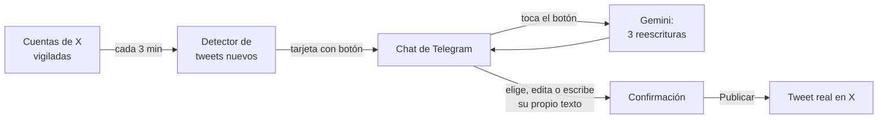

# X → Telegram → X: gestor de tweets asistido por IA

Un sistema que vigila cuentas de X (Twitter), avisa por Telegram cada vez que publican una novedad y, con un toque, ayuda a armar y publicar un tweet propio a partir de esa noticia — con tres reescrituras propuestas por IA para elegir.

Lo desarrollé para un amigo influencer que gestiona sus cuentas de X siguiendo las novedades de su rubro (noticias cripto). Antes tenía que estar pendiente de las cuentas fuente, copiar la noticia, reescribirla y publicarla a mano. Ahora el sistema hace la vigilancia y el borrador, y él solo decide qué sale.

> **Desarrollado en conjunto con Claude** (Anthropic), trabajando desde la consola con Claude Code. Las reescrituras de tweets las hace la **API de Gemini** (Google), que el sistema consume en producción. Ver [Cómo se hizo](#cómo-se-hizo).

---

## Qué hace



1. **Vigila** un conjunto de cuentas de X y detecta cada tweet nuevo (revisa cada 3 minutos).
2. **Avisa** por Telegram con una tarjeta que trae el tweet original y un botón.
3. **Propone**: al tocar el botón, el sistema consume la **API de Gemini** para generar 3 reescrituras del tweet (máximo 280 caracteres, sin inventar información).
4. **Deja decidir**: se elige una propuesta, se edita o se escribe un texto propio, y aparece una tarjeta de confirmación con **Publicar / Seguir editando / Descartar**.
5. **Publica** el tweet real en la cuenta de X configurada.

Nada se publica sin una confirmación explícita, y el sistema está diseñado para que un tweet **nunca se publique dos veces** (ver [Decisiones de diseño](#decisiones-de-diseño)).

---

## Stack

| Capa | Tecnología | Para qué |
|---|---|---|
| Lenguaje | **Python 3.14** | Todo el backend |
| Lectura y publicación en X | **twscrape** + **httpx** | Sesión de una cuenta de X; lee tweets y publica reusando esa misma sesión (sin API oficial, que requiere plan de developer y algunos niveles son pagos) |
| Servicio interno HTTP | **Flask** + **Waitress** | Expone `/check`, `/borradores` y `/publicar` entre los dos procesos |
| Interfaz de usuario | **python-telegram-bot** (con job-queue) | Tarjetas, botones inline, respuestas de texto y el chequeo periódico |
| IA en la app | **API de Google Gemini** (`google-genai`, modelo `gemini-3.6-flash`) | Reformula cada tweet en 3 versiones, con salida JSON estructurada |
| Persistencia | **SQLite** en modo WAL | Estado de cada borrador y candado contra doble publicación, compartido por dos procesos |
| Despliegue | **Docker** + **Docker Compose** | La app está dockerizada: una imagen (`python:3.14-slim`) y dos servicios (`bot-tweets` y `telegram-poller`) con reinicio automático |
| Otros | loguru, PyOTP, beautifulsoup4, fake-useragent | Logs, soporte de login de X y utilidades |

Dependencias fijadas a versión exacta en [`requirements.txt`](requirements.txt).

### Arquitectura en una mirada

Dos programas y un módulo compartido, cada uno con una responsabilidad:

- [`bot_x.py`](bot_x.py) — habla con X: detecta tweets nuevos y publica. Expone el servicio HTTP interno.
- [`bot_telegram.py`](bot_telegram.py) — habla con Telegram: detección periódica, conversación con el usuario y llamadas a la IA. La conversación es una máquina de estados: `nuevo → esperando_texto → confirmando → publicado` (o `cancelado`).
- [`estado_db.py`](estado_db.py) — único punto de acceso a la base SQLite compartida.

El detalle clase por clase está en [`docs/ARQUITECTURA.md`](docs/ARQUITECTURA.md).

---

## Cómo se hizo

Hay dos IA distintas en este proyecto, con roles separados:

| | Rol | Cómo interviene |
|---|---|---|
| **Claude** (Anthropic) | Compañero de desarrollo | Lo usé desde la **consola** (Claude Code): diseñar, escribir, refactorizar y probar el código en conjunto |
| **Gemini** (Google) | Parte del producto | La app **consume su API** en producción para reformular los tweets |

Claude construyó el sistema conmigo; Gemini es lo que el sistema usa cuando corre. El desarrollo fue incremental:

1. **Definir la herramienta y probar que era posible.** Antes de diseñar nada, lo primero fue decidir qué construir y avanzar con código real para verificar que fuera realizable: ¿se pueden detectar tweets nuevos de forma confiable sin la API oficial?, ¿se puede publicar?, ¿cómo se maneja la conversación en Telegram? El primer prototipo fue un workflow de **n8n**, que sirvió para validar el flujo completo rápido.
2. **Pasar a código propio y dockerizarlo.** Una vez validado, el flujo se migró a Python y se empaquetó con **Docker**, que fue también una herramienta de trabajo: el sistema se desarrolló, probó y corre siempre dentro de contenedores, así que el entorno es el mismo en cualquier máquina. Quedaron dos servicios, una base compartida y el código reorganizado en clases con una responsabilidad cada una, pensando en que fuera fácil de mantener y de ampliar.
3. **Incorporar la IA con criterio de eficiencia.** Recién con el flujo estable se sumó la IA para las reescrituras, cuidando la configuración y el consumo de tokens (detalle abajo).
4. **Endurecer con QA.** Se escribieron scripts de prueba contra el chat real (en [`tools/`](tools/)) para romper el flujo con casos límite: dobles toques, textos vacíos o de más de 280 caracteres, respuestas ambiguas de X, etc.

### Dockerización

- **Una sola imagen** ([`Dockerfile`](Dockerfile)) basada en `python:3.14-slim`, con dependencias fijadas, que sirve a los dos servicios: cambia solo el comando de arranque.
- **Dos servicios** en [`docker-compose.yml`](docker-compose.yml): `bot-tweets` (cliente de X y servicio HTTP) y `telegram-poller` (Telegram e IA), ambos con `restart: unless-stopped`.
- **Secretos fuera de la imagen**: se inyectan en tiempo de ejecución con `env_file: .env`, nunca se copian al build (ver [`.dockerignore`](.dockerignore)).
- **Estado persistente en volúmenes**: `datos/` y `accounts.db` viven fuera del contenedor, así que reconstruir o reiniciar no pierde borradores. Se monta el *directorio* y no el archivo porque SQLite en modo WAL necesita compartir los archivos `-wal` y `-shm` entre los dos contenedores.
- **Puerto solo local**: el servicio HTTP interno escucha únicamente en `127.0.0.1:5000`.

### Uso eficiente de la IA (configuración y tokens)

Reescribir un tweet es una tarea chica, y el código está ajustado a eso:

- **Modelo liviano**: la línea *flash* de Gemini alcanza de sobra para esta tarea y tiene un nivel gratuito generoso para el volumen de uso.
- **Razonamiento mínimo** (`thinking_level=MINIMAL`): probado contra la API real, sin esto el modelo gastaba unos ~500 tokens de "razonamiento" de más por pedido.
- **Salida estructurada**: se pide JSON con un esquema definido, así que no hay que interpretar texto libre ni gastar tokens en explicaciones.
- **Prompt corto y acotado**: mismo sentido, 3 alternativas distintas, hasta 280 caracteres, sin inventar datos.
- **La IA se llama solo cuando hace falta**: no por cada tweet detectado, sino únicamente cuando el usuario toca el botón. Y "Seguir editando" reofrece las mismas 3 propuestas **sin** otra llamada.
- **Un solo cliente por proceso**, con timeout explícito (15 s) para que una llamada colgada nunca congele el bot.
- **Reintento acotado**: si una propuesta se pasa de 280 caracteres, se reintenta una sola vez; si vuelve a pasarse, se recorta en el último espacio.
- **Degradación elegante**: si se agota la cuota gratuita o falla la red, el bot no se traba: pide el texto a mano y avisa el motivo.
- **Modo de prueba sin costo**: sin `GEMINI_API_KEY` devuelve propuestas de prueba, para desarrollar el resto del flujo sin gastar llamadas.

Del lado de X aplica el mismo criterio: se guarda el último tweet visto por cuenta (`since_id`) para traer solo lo nuevo, se recorren como máximo 3 páginas por chequeo y hay una pausa de 2 segundos entre cuentas para cuidar el límite de pedidos.

---

## Decisiones de diseño

- **Nunca publicar dos veces.** Cada borrador toma un candado en la base antes de publicar. Además, el botón "Publicar" lleva una huella (hash) del texto: si el texto cambió desde que se armó la tarjeta, no publica.
- **Ante la duda, no asumir.** Publicar usa un endpoint interno de X. Si la respuesta no es exactamente la esperada, el resultado se marca como `ambiguo` y el borrador queda en `revision_manual` **sin liberar el candado**, en vez de arriesgar un tweet duplicado.
- **Fallas que se recuperan solas.** Si un aviso falla, no se avanza el `since_id`: el tweet se reintenta en el próximo chequeo en vez de perderse.
- **Modo simulado.** Con `MODO_PUBLICACION=mock` se prueba toda la conversación sin publicar tweets reales.
- **Sin secretos en el repositorio.** Toda la configuración sensible vive en `.env` (ver [`.env.example`](.env.example)), que no se versiona.

---

## Cómo correrlo

Requisitos: **Docker Desktop** abierto y corriendo, una cuenta de X, un bot de Telegram (token de [@BotFather](https://t.me/BotFather)) y una API key de [Google AI Studio](https://aistudio.google.com/).

```bash
# 1. Clonar el repositorio
git clone https://github.com/nicyar/Automatizacion-de-X.git
cd Automatizacion-de-X

# 2. Configuración: copiar la plantilla y completar los valores (ver la tabla de abajo)
cp .env.example .env

# 3. Construir y levantar los dos servicios en segundo plano
docker compose up -d --build

# 4. Ver que estén corriendo y seguir los logs
docker ps
docker compose logs -f
```

### Configuración (`.env`)

| Variable | Qué es | Cómo conseguirla |
|---|---|---|
| `USERNAME`, `EMAIL`, `PASSWORD` | Cuenta de X con la que se lee y se publica | Los datos de la cuenta |
| `COOKIES` | Sesión de esa cuenta, con el formato `auth_token=...; ct0=...` | Con la sesión iniciada en el navegador: herramientas de desarrollador → Application → Cookies → `x.com` |
| `CUENTAS_X` | Cuentas a vigilar, separadas por coma y sin `@` (ej. `cuentaUno,cuentaDos`) | Las que quieras seguir. Si se omite, usa una lista de ejemplo |
| `TELEGRAM_BOT_TOKEN` | Token del bot | Crear un bot con [@BotFather](https://t.me/BotFather) |
| `CHAT_ID` | Chat de Telegram al que responde el bot | Escribirle al bot y consultar tu id con [@userinfobot](https://t.me/userinfobot) |
| `GEMINI_API_KEY` | Clave de la API de Gemini | [Google AI Studio](https://aistudio.google.com/) (tiene nivel gratuito) |
| `MODO_PUBLICACION` | Opcional. `mock` simula la publicación | — |

El estado (borradores y sesión de X) se guarda en `datos/`, que se crea solo la primera vez.

Para probar sin publicar tweets reales, agregar `MODO_PUBLICACION=mock` al `.env` y reconstruir con `docker compose up -d --build`. Sin `GEMINI_API_KEY` el bot funciona igual, con propuestas de prueba en lugar de IA. La guía completa de operación (apagar, respaldos, archivos delicados) está en [`docs/ARQUITECTURA.md`](docs/ARQUITECTURA.md#4-cómo-correrlo).

### Estructura del repositorio

```
├── bot_x.py            # Cliente de X + servicio HTTP interno
├── bot_telegram.py     # Bot de Telegram, conversación e IA
├── estado_db.py        # Acceso a la base SQLite compartida
├── tools/              # Scripts de QA contra el chat real
├── docs/ARQUITECTURA.md
├── LICENSE             # MIT
├── Dockerfile
├── docker-compose.yml
├── requirements.txt
└── .env.example
```

---

## Aviso

El sistema no usa la API oficial de X: lee y publica con la sesión de una cuenta ya logueada, mediante la librería `twscrape` y un endpoint interno no documentado. Eso significa que X puede cambiarlo sin avisar (el sistema está preparado para detectarlo y frenar en vez de publicar mal) y que su uso debe ser acorde a los términos de X. Pensado para uso personal sobre cuentas propias.

---

## Licencia

[MIT](LICENSE) © 2026 nicyar
